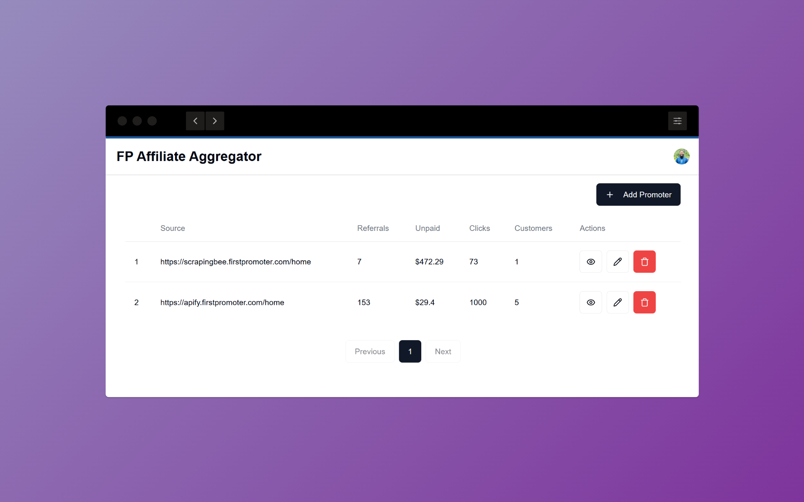

# FirstPromoter Affiliate Aggregator



## Overview

FirstPromoter Affiliate Aggregator is a tool designed to manage and aggregate affiliate data from FirstPromoter. It provides endpoints to create, update, delete, and retrieve promoter data, as well as manual run and webhook functionalities.

## Setup

1. Copy `.env.example` to `.env` and set the variables.

## Run

1. Install dependencies:
    ```sh
    pnpm install
    ```

2. Sync the database:
    ```sh
    pnpm db:deploy
    ```

3. Run the server:
    ```sh
    pnpm dev
    ```

4. Open [http://localhost:3000](http://localhost:3000) in your browser.

## Environment Variables

Refer to `.env.example` for the environment variables required to run the project.

## Production

To run the project in production:

1. Install dependencies:
    ```sh
    pnpm install
    ```

2. Sync the database:
    ```sh
    pnpm db:deploy
    ```

3. Build the project:
    ```sh
    pnpm build
    ```

4. Start the server:
    ```sh
    pnpm start
    ```

## Docker

To run the project using Docker:

```sh
docker compose up -d --build
```

## Clerk Setup

### Initial Setup

1. Login to Clerk dashboard.
2. Create a project and save the credentials to `.env`.

### Optional: Clerk Webhook

Clerk webhook is used to get user created, updated, and deleted events. This is useful to create a promoter when a user is created and delete the promoter when a user is deleted.

1. Go to `Configure` -> `Webhook` -> `Add Endpoint` and add the ngrok tunnel or cloudflare tunnel URL. Note: you need to point the tunnel to the running server. The webhook will run at `/api/webhook`, so your URL should be like `https://<ngrok-url>/api/webhook`.
2. Select these events:
    - User created
    - User updated
    - User deleted
3. Click `Create`.
4. Save the `Signing Secret` to `.env`.

## Endpoints

### Get all promoters

```
GET /api/promoters

Authorization: Bearer <user_id>
```

### Get single promoter

```
GET /api/promoters/:id

Authorization: Bearer <user_id>
```

### Create promoter

```
POST /api/promoters

Authorization: Bearer <user_id>
```

Sample body:

```json
{
  "source": "https://apify.firstpromoter.com",
  "email": "test@example.com",
  "password": "password123",
  "schedule": "0 1 * * *"
}
```

or

```json
{
  "source": "https://apify.firstpromoter.com",
  "email": "test@example.com",
  "password": "password123",
  "manualRun": true,
  "isEnabled": false
}
```

### Update promoter

```
PATCH /api/promoters/:id

Authorization: Bearer <user_id>
```

Sample body:

```json
{
  "isEnabled": false
}
```

or

```json
{
  "schedule": "0 1 * * *"
}
```

### Delete promoter

```
DELETE /api/promoters/:id

Authorization: Bearer <user_id>
```

### Manual run

```
GET /api/manual-run/:id

Authorization: Bearer <user_id>
```

### SSE

```
GET /api/sse/:id

Authorization: Bearer <user_id>
```

This endpoint will stream the promoter data to the client.

### Webhook

```
POST /api/webhook
```

This endpoint is used by Clerk to send webhooks when a user is created, updated, or deleted.

## Sample Outputs

### Sample Promoter Output

```json
{
  "id": "cm3xethgs0002ty2k0ey1h5ur",
  "source": "https://apify.firstpromoter.com",
  "email": "test@example.com",
  "password": "password123",
  "manualRun": false,
  "isEnabled": true,
  "schedule": "0 1 * * *",
  "createdAt": "2024-01-01T00:00:00.000Z",
  "updatedAt": "2024-01-01T00:00:00.000Z"
}
```

### Sample PromoterData Outputs

```json
{
  "id": "cm3xethms0004ty2krimjv3ww",
  "promoterId": "cm3xethgs0002ty2k0ey1h5ur",
  "unpaid": 560000,
  "referral": 11,
  "clicks": 110,
  "customers": 11,
  "status": "SUCCESS",
  "createdAt": "2024-01-01T00:00:00.000Z",
  "updatedAt": "2024-01-01T00:00:00.000Z"
}
```

Failed status:

```json
{
  "id": "cm3xethms0004ty2krimjv3ww",
  "promoterId": "cm3xethgs0002ty2k0ey1h5ur",
  "unpaid": 560000,
  "referral": 11,
  "clicks": 110,
  "customers": 11,
  "status": "FAILED",
  "failedMessage": "Error message",
  "createdAt": "2024-01-01T00:00:00.000Z",
  "updatedAt": "2024-01-01T00:00:00.000Z"
}
```